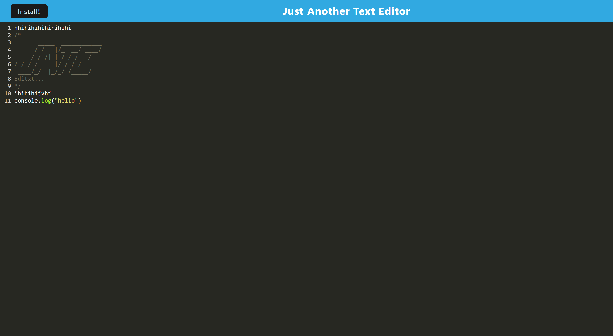
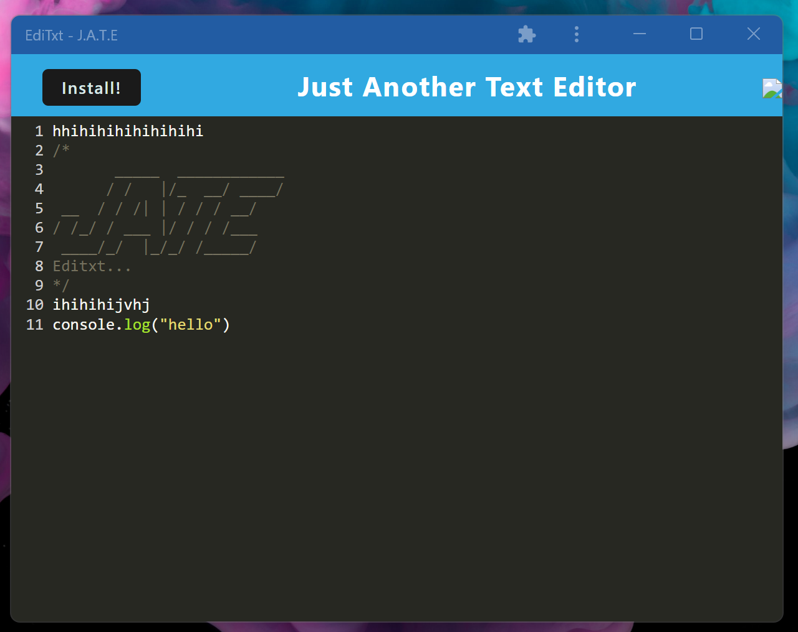

# Editxt

## Deployed Application
https://edi-txt.herokuapp.com/
## Description
Editxt is a text editor running in the browser. It is a single page application that meets PWA criteria and features data presistent techniques. Editxt can also be installed to your local machine and function offline.
## features
- Database storage through IndexedDB.
- A registered service worker using workbox.
- Ability to install to local machine.
## Technologies Used
- HTML: to display page and page strucute.
- CSS: to integrate styling to the application.
- Javascript: to add functionality and local storage.
- Node.js: back-end javaScript runtime environment.
- Express.js: framework for building applications.
- Concurrently: allows for running multiple scripts simultaneously.

